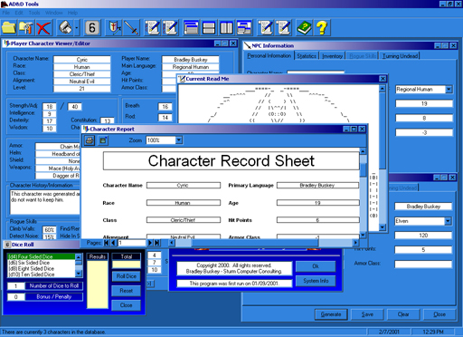



## AD&D Toolkit 1\.50 \(Updated Zip\)

### Description

UPDATE: Added a compiled HTML Help File (.chm) I am sorry about the file size (1.9 MB) Has NPC Gen, PC DB with edit capabilities, and Dice Rolling. It also allows you to print the characters and their stats in an Access Report style. This is currently loosly based on AD&D 1st edition rules with player expansion modules. Whether you play AD&D or not, this code demonstrates the use of databases and accessing and changing multiple tables, printing reports, generating random numbers, generating random data that follows rules and constraints and working with MDI forms. It also shows how to maintain program settings via the registry and demonstrates a quick and easy way of creating a time-limited program. All and all, a lot of functions are gone over here. Look beyond the program function and focus on the code functions. == Changes == I commented the functions in this updated zip file. Changed the Report writer to use ODBC instead of Jet 4.0. Saved the database in Access97 format for those who do not have Office 2000. Fixed Path statements for Database in Program startup and in the Data Report connection string. Comments/Suggestions are welcome and encouraged.
 
### More Info
 

             |
---                |---
**Submitted On**   |2001-02-09 16:37:00
**By**             |[VBScript](https://github.com/Planet-Source-Code/PSCIndex/blob/master/ByAuthor/vbscript.md)
**Level**          |Intermediate
**User Rating**    |4.3 (17 globes from 4 users)
**Compatibility**  |VB 6\.0
**Category**       |[Complete Applications](https://github.com/Planet-Source-Code/PSCIndex/blob/master/ByCategory/complete-applications__1-27.md)
**World**          |[Visual Basic](https://github.com/Planet-Source-Code/PSCIndex/blob/master/ByWorld/visual-basic.md)
**Archive File**   |[CODE\_UPLOAD14736292001\.zip](https://github.com/Planet-Source-Code/vbscript-ad-d-toolkit-1-50-updated-zip__1-15093/archive/master.zip)

